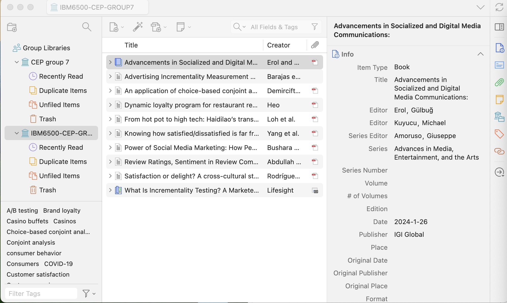
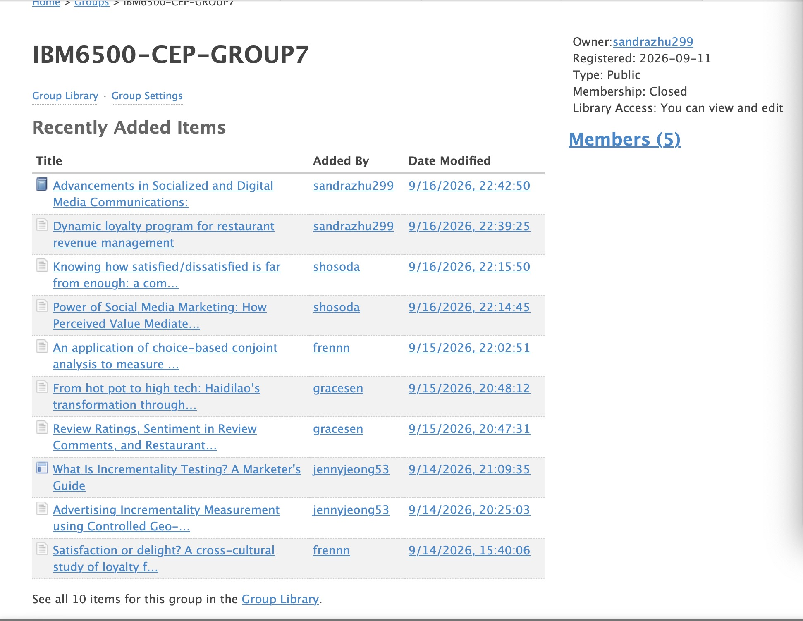

# Zotero Group Library Screenshot

> Screenshot showing:
>
> -   The group library name
>
> -   Several source titles
>
> -   Evidence that the sources are organized in Zotero 
>
> -   Evidence that each member contributed at least two articles to the database; **the contributor's name should show up**.

# Example Zotero Item Screenshot

> Screenshot of one completed Zotero item showing:
>
> -   Citation information
>
> -   Attached PDF, snapshot, or URL if available
>
> -   Notes
>
> -   Tags

# Group Source Summary Table

+----------------------------------------------------------------------------------------------------------------------------------------------------------------------+----------------+------------------+-------------------------------------------------------------------------------------------------------------------------------------------------------------------------------------------------------------------------------------------------------------------------------------------------------------------------------------------------------------------------------------------------------------------------------------------------------------------------------------------------------------------------------------------------------------------------------------------------------------------------------+
| Source Title                                                                                                                                                         | Contributed By | Type of Source   | Why This Source Is Useful                                                                                                                                                                                                                                                                                                                                                                                                                                                                                                                                                                                                     |
+======================================================================================================================================================================+================+==================+===============================================================================================================================================================================================================================================================================================================================================================================================================================================================================================================================================================================================================================+
| Review Ratings, Sentiment in Review Comments, and Restaurant Profitability: Firm-Level Evidence                                                                      | Grace Sen      | Journal Article  | This study examines how online ratings and written review comments relate to restaurant profitability. It found that the sentiment expressed in review comments may be more important than the numerical rating alone. Our group can use this idea to analyze comments about broth, ingredient quality, service, waiting time, cleanliness, atmosphere, and value. These findings can help the restaurant improve its operations and decide which positive customer experiences to highlight in its digital marketing.                                                                                                        |
+----------------------------------------------------------------------------------------------------------------------------------------------------------------------+----------------+------------------+-------------------------------------------------------------------------------------------------------------------------------------------------------------------------------------------------------------------------------------------------------------------------------------------------------------------------------------------------------------------------------------------------------------------------------------------------------------------------------------------------------------------------------------------------------------------------------------------------------------------------------+
| From hot pot to high tech: Haidilao’s transformation through digital technologies for sustainable business in the restaurant industry                                | Grace Sen      | Journal Article  | This article explains how Haidilao used digital technology to improve its hotpot restaurant business and customer experience. It discusses online ordering, delivery, social media, intelligent operations, and other digital services.                                                                                                                                                                                                                                                                                                                                                                                       |
|                                                                                                                                                                      |                |                  |                                                                                                                                                                                                                                                                                                                                                                                                                                                                                                                                                                                                                               |
|                                                                                                                                                                      |                |                  | Our group can use this case as a framework for connecting the shabu restaurant’s marketing channels, reservations, POS data, loyalty program, and customer communication. Since Haidilao is a large chain, we would adapt its ideas into a smaller and more affordable system for an independent restaurant.                                                                                                                                                                                                                                                                                                                  |
+----------------------------------------------------------------------------------------------------------------------------------------------------------------------+----------------+------------------+-------------------------------------------------------------------------------------------------------------------------------------------------------------------------------------------------------------------------------------------------------------------------------------------------------------------------------------------------------------------------------------------------------------------------------------------------------------------------------------------------------------------------------------------------------------------------------------------------------------------------------+
| An application of choice-based conjoint analysis to measure willingness to pay for casino buffets                                                                    | Frank Renn     | Journal Article  | The study examines what drives customers’ willingness to pay for all-you-can-eat casino buffets.\                                                                                                                                                                                                                                                                                                                                                                                                                                                                                                                             |
|                                                                                                                                                                      |                |                  | Its choice-based conjoint analysis of 483 U.S. consumers provides stronger evidence than a simple satisfaction survey.\                                                                                                                                                                                                                                                                                                                                                                                                                                                                                                       |
|                                                                                                                                                                      |                |                  | Food quality is identified as the most important factor, followed by actual price and service quality.\                                                                                                                                                                                                                                                                                                                                                                                                                                                                                                                       |
|                                                                                                                                                                      |                |                  | The findings help managers prioritize menu quality, pricing, service, and promotional positioning.\                                                                                                                                                                                                                                                                                                                                                                                                                                                                                                                           |
|                                                                                                                                                                      |                |                  | Although focused on Las Vegas casino buffets, the study offers a useful framework for researching AYCE marketing in California.                                                                                                                                                                                                                                                                                                                                                                                                                                                                                               |
+----------------------------------------------------------------------------------------------------------------------------------------------------------------------+----------------+------------------+-------------------------------------------------------------------------------------------------------------------------------------------------------------------------------------------------------------------------------------------------------------------------------------------------------------------------------------------------------------------------------------------------------------------------------------------------------------------------------------------------------------------------------------------------------------------------------------------------------------------------------+
| Satisfaction or delight? A cross-cultural study of loyalty formation linked to two restaurant types                                                                  | Frank Renn     | Journal Article  | The article explains how customer satisfaction and delight contribute to restaurant loyalty. It also demonstrates that their effects vary by restaurant type and customers’ long- or short-term orientation. These findings can help restaurants design more personalized CRM strategies, including immediate rewards, loyalty programs, and unexpected benefits.                                                                                                                                                                                                                                                             |
+----------------------------------------------------------------------------------------------------------------------------------------------------------------------+----------------+------------------+-------------------------------------------------------------------------------------------------------------------------------------------------------------------------------------------------------------------------------------------------------------------------------------------------------------------------------------------------------------------------------------------------------------------------------------------------------------------------------------------------------------------------------------------------------------------------------------------------------------------------------+
| What Is Incrementality Testing? A Marketer's Guide                                                                                                                   | Yujin Jeong    | Magazine Article | This industry guide explains practical methods for implementing incrementality testing to calculate incremental Return on Ad Spend (iROAS). It provides a step-by-step framework for isolating conversions caused by ads versus natural baselines. This source directly addresses the AO's research question regarding how to evaluate Meta and Google Ads performance efficiently within a limited media budget.                                                                                                                                                                                                             |
+----------------------------------------------------------------------------------------------------------------------------------------------------------------------+----------------+------------------+-------------------------------------------------------------------------------------------------------------------------------------------------------------------------------------------------------------------------------------------------------------------------------------------------------------------------------------------------------------------------------------------------------------------------------------------------------------------------------------------------------------------------------------------------------------------------------------------------------------------------------+
| Advertising Incrementality Measurement using Controlled Geo-Experiments: The Universal App Campaign Case Study                                                       | Yujin Jeong    | Journal Article  | This paper provides a robust methodological framework for measuring the causal impact of digital advertising through controlled experiments. It utilizes Bayesian structural time series to predict baseline counterfactuals and measure incremental conversions when ad spend is suspended. This methodology directly supports the AO's objective of establishing a POS data baseline and validating the incremental profit generated during alternating-week A/B tests for Avenue Shabu.                                                                                                                                    |
+----------------------------------------------------------------------------------------------------------------------------------------------------------------------+----------------+------------------+-------------------------------------------------------------------------------------------------------------------------------------------------------------------------------------------------------------------------------------------------------------------------------------------------------------------------------------------------------------------------------------------------------------------------------------------------------------------------------------------------------------------------------------------------------------------------------------------------------------------------------+
| Dynamic loyalty program for restaurant revenue management                                                                                                            | Sandy Zhu      | Journal Article  | This source can help us develop a promotion strategy that focuses on customer retention without relying only on discounts. The study suggests that restaurants can offer different loyalty rewards depending on demand, such as giving customers more points when they visit during slower hours or days. This can encourage customers to return while also helping the restaurant increase traffic during off-peak periods. The study found that loyalty incentives were especially effective among younger customers, which could be useful if our shabu-shabu restaurant targets students and young adults.                |
+----------------------------------------------------------------------------------------------------------------------------------------------------------------------+----------------+------------------+-------------------------------------------------------------------------------------------------------------------------------------------------------------------------------------------------------------------------------------------------------------------------------------------------------------------------------------------------------------------------------------------------------------------------------------------------------------------------------------------------------------------------------------------------------------------------------------------------------------------------------+
| Perspectives of Digital Marketing for the Restaurant Industry                                                                                                        | Sandy Zhu      | Book Chapter     | This source can help us develop the new-customer acquisition side of the promotion strategy. The chapter explains that restaurants can use social media, online advertising, online reviews, influencers and food bloggers, online ordering, and customer data to improve visibility and develop customer relationships.                                                                                                                                                                                                                                                                                                      |
+----------------------------------------------------------------------------------------------------------------------------------------------------------------------+----------------+------------------+-------------------------------------------------------------------------------------------------------------------------------------------------------------------------------------------------------------------------------------------------------------------------------------------------------------------------------------------------------------------------------------------------------------------------------------------------------------------------------------------------------------------------------------------------------------------------------------------------------------------------------+
| Knowing how satisfied/dissatisfied is far from enough: a comprehensive customer satisfaction analysis framework based on hybrid text mining techniques               | sora Hosada    | Magazine Article | This study analyzed 19,133 online reviews from 31 restaurants in Universal Beijing Resort. The researchers used text-mining methods to identify dissatisfaction factors and rank improvement opportunities. Dish taste, waiter attitude, and decoration were identified as major improvement areas. The framework can help organize Avenue Shabu’s reviews, but the study was conducted in a different restaurant setting.                                                                                                                                                                                                    |
+----------------------------------------------------------------------------------------------------------------------------------------------------------------------+----------------+------------------+-------------------------------------------------------------------------------------------------------------------------------------------------------------------------------------------------------------------------------------------------------------------------------------------------------------------------------------------------------------------------------------------------------------------------------------------------------------------------------------------------------------------------------------------------------------------------------------------------------------------------------+
| Power of Social Media Marketing: How Perceived Value Mediates the Impact on Restaurant Followers’ Purchase Intention, Willingness to Pay a Premium Price, and E-WoM? | sora Hosada    | Journal Article  | This study examines how restaurant social media marketing activities affect perceived value, purchase intention, willingness to pay a premium price, and electronic word-of-mouth. The marketing activities include customization, entertainment, trendiness, and interaction. The researchers collected online survey responses from 433 followers of ten casual-dining restaurants in Saudi Arabia and analyzed the data using PLS-SEM. Social media marketing activities had positive relationships with perceived value and the three behavioral intentions. Perceived value also partially mediated these relationships. |
+----------------------------------------------------------------------------------------------------------------------------------------------------------------------+----------------+------------------+-------------------------------------------------------------------------------------------------------------------------------------------------------------------------------------------------------------------------------------------------------------------------------------------------------------------------------------------------------------------------------------------------------------------------------------------------------------------------------------------------------------------------------------------------------------------------------------------------------------------------------+

# Zotero Group Library Link or Invitation Information

<https://www.zotero.org/groups/6668148/ibm6500-cep-group7>

# Optional Google Drive Link

<https://drive.google.com/drive/folders/1CDA1ZVz-kj--KlSA3IQqXWMZ0Tn6SEQb?usp=drive_link>

# Appendix

GitHub Repo: https://github.com/falasol/MSDM-CEP

GitHub Pages:
